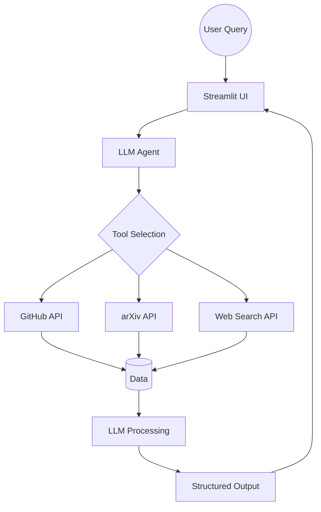

# AI Industry Intelligence Analyst

---

## Overview
**AI Industry Intelligence Analyst** is a production-style **LLM-powered intelligent agent** that analyzes and summarizes real-time developments in Artificial Intelligence.

The system integrates live data from:
- **GitHub repositories**
- **arXiv research papers**
- **Web search (real-time news)**

It dynamically selects the appropriate data source using **LLM-based tool orchestration**, generating structured and human-readable insights.

---

## Problem Statement
The AI ecosystem evolves rapidly, with valuable information scattered across research papers, open-source repositories, and online sources.

Tracking this manually is:
- Time-consuming  
- Inefficient  
- Fragmented  

This project solves the problem by building an intelligent system that:

- Aggregates real-time data from multiple sources  
- Filters and prioritizes relevant information  
- Generates concise, structured insights  
- Enables conversational exploration of AI trends  

---

## Business Objective
- Build a unified platform for real-time AI insights  
- Reduce manual effort in tracking AI developments  
- Deliver structured and actionable intelligence  
- Enable intelligent interaction with live data  

---

## Key Features

- **LLM Tool-Orchestrated Agent**  
  Dynamically selects tools based on user intent  

- **Multi-Source Integration**
  - GitHub → latest AI repositories  
  - arXiv → latest research papers  
  - Web Search → real-time AI news  

- **Real-Time Data Processing**  
  Fetches and processes live data on demand  

- **Conversational Interface**  
  Built with Streamlit for interactive querying  

- **Context-Aware Responses**  
  Maintains session-based memory  

- **Optimized Performance**
  - Caching (LRU Cache)  
  - Reduced API calls  

---

## System Architecture


## 📂 Project Structure
```
ai_industry_intelligence_analyst/
│
├── main.py                 # Streamlit UI
├── agent.py                # Core agent logic
├── tools.py                # Tool integration layer
│
├── src/
│   ├── github_fetcher.py   # GitHub API integration
│   ├── arxiv_fetcher.py    # arXiv API integration
│   └── search_server.py    # Web search (Tavily)
│
├── .env                    # API keys
├── pyproject.toml          # Dependencies
└── README.md
```

## Technologies Used

- Python 3.10+
- Streamlit (UI)
- OpenAI API (LLM + tool calling)
- GitHub REST API
- arXiv API
- Tavily Search API
- uv (package manager)

## Installation & Setup

**1. Clone the Repository**
```
git clone https://github.com/hemanthk24/AI-Industry-Intelligence-Analyst.git
cd AI-Industry-Intelligence-Analyst
```
**2. Install Dependencies**
```     
uv sync
```
**3. Setup Environment Variables**

Create a ``.env``` file:
```
OPENAI_API_KEY=your_api_key_here
TAVILY_API_KEY=your_api_key_here
```
**4. Run the Application**
```bash
uv run streamlit run main.py
```

## Usage

**Ask questions like:**

- "Latest AI news today"
- "Recent machine learning research papers"
- "Trending AI GitHub repositories"
- "Explain latest LLM advancements"

## How It Works
- User Query → Input via Streamlit UI
- LLM Decision → Determines if tools are needed
- Tool Execution → Calls APIs (GitHub, arXiv, Web)
- Data Retrieval → Fetches real-time information
- LLM Processing → Summarizes and structures output
- Final Response → Displayed to user

## Future Improvements
- Redis-based caching (production-level optimization)
- Advanced ranking of repositories and papers
- Integration with Hugging Face & research datasets
- Streaming responses (real-time typing effect)
- Improved UI (ChatGPT-style interface)

## Conclusion

This project demonstrates a real-world implementation of LLM-based tool orchestration, enabling dynamic data retrieval and intelligent summarization.

It showcases:

- System design thinking
- API integration
- Agent-based architecture
- Real-time AI intelligence generation

## 🌐 Live Demo

https://ai-industry-intelligence-analyst.streamlit.app/